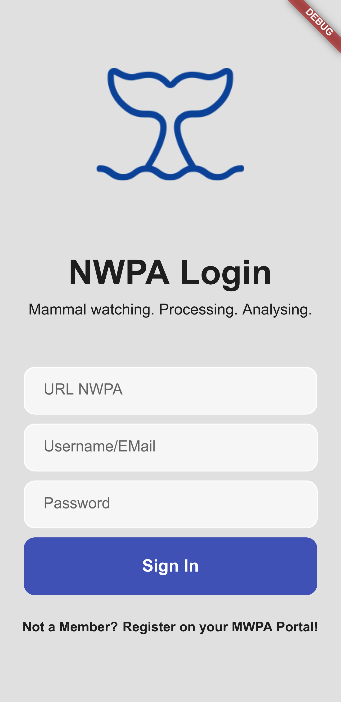

NOTE: This document is under development. Please check regularly for updates!

<h1 align="center">

App for MWPA

</h1>

Mammal watching. Processing. Analysing.

Processing and analysing data gathered by mammal watching.

## Information

More information about the project can be found here: [NWPA](https://github.com/M-E-E-R-e-V/mwpa)

This part of NWPA is for the end devices. The software synchronizes data, new data can be recorded (also offline) and transferred back to the NWPA.

The app is implemented with Flutter (Dart) and should support the following platforms:

* Android
* IOS
* Web

## Screenshots
<table>
  <tr>
    <td> 
      
    </td>
  </tr>
</table>

## TODO 
https://docs.flutter.dev/cookbook/persistence/sqlite