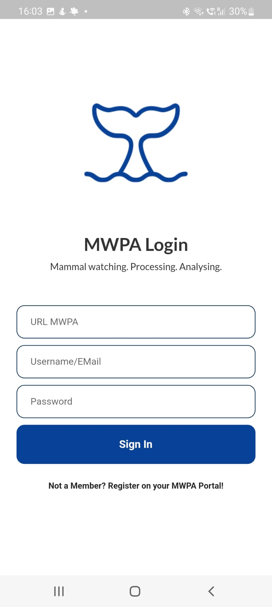
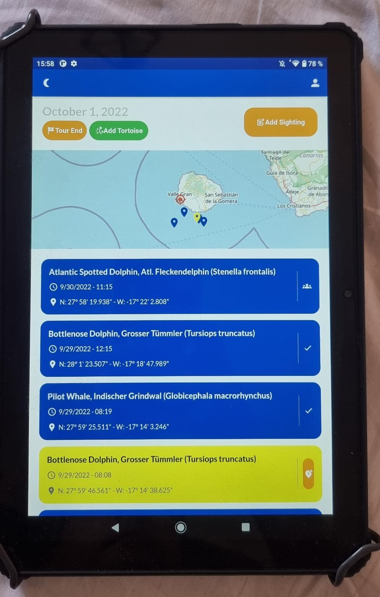
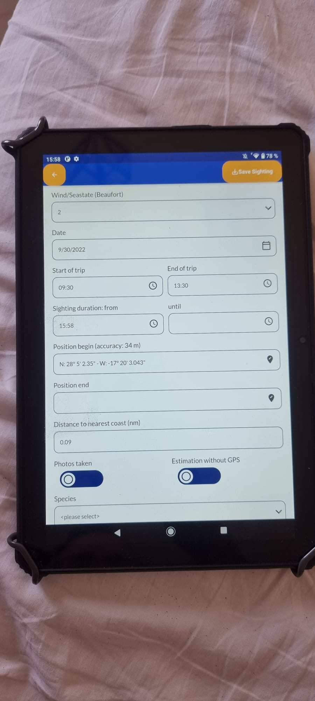
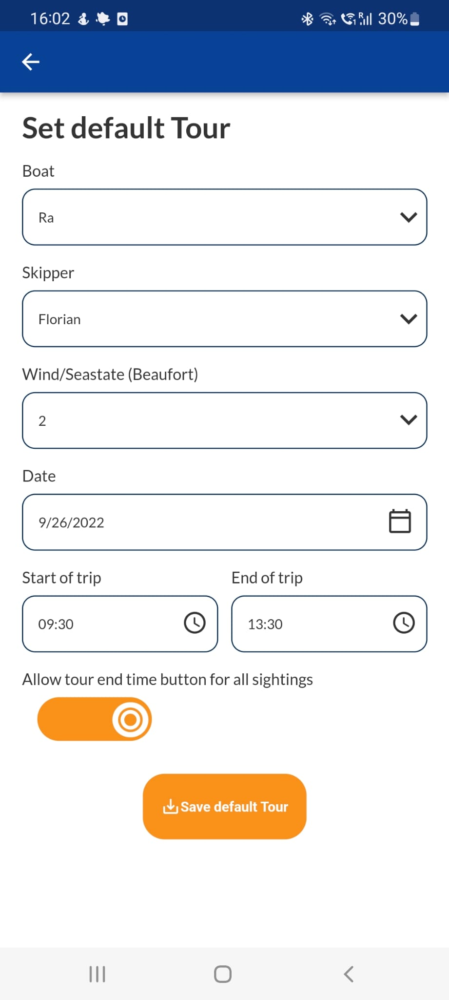
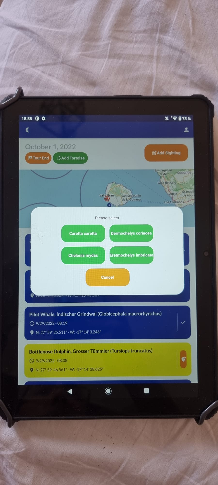

NOTE: This document is under development. Please check regularly for updates!

<h1 align="center">

App for MWPA

</h1>

Mammal watching. Processing. Analysing.

Processing and analysing data gathered by mammal watching.

## Information

More information about the project can be found here: [MWPA](https://github.com/M-E-E-R-e-V/mwpa)

This part of MWPA is for the end devices. The software synchronizes data, new data can be recorded (also offline) and transferred back to the MWPA.

The app is implemented with Flutter (Dart) and should support the following platforms:

* Android
* IOS
* Web

## Screenshots
<table>
  <tr>
    <td> 
      
    </td>
    <td> 
      
    </td>
  </tr>
  <tr>
    <td> 
      
    </td>
    <td> 
      
    </td>
  </tr>
  <tr>
    <td colspan="2">
        
    </td>
  </tr>
</table>

## IDE Setup
* Use Android Studio
* Install Flutter: https://docs.flutter.dev/get-started/install/linux
  * Install Dart SDK: https://dart.dev/get-dart
  * Install Android Studio Flutter Plugin
  * Set the Dart SDK in Android Studio: Settings -> Language & Frameworks -> Dart -> Dart SDK Path: /home/user/flutter/bin/cache/dart-sdk

* Right Click to pubspec.yaml
  * Flutter -> Flutter Pub Get
  * Flutter -> Flutter Pub Upgrade
  * Flutter -> Flutter Upgrade

* Add for Debuger 2 Task:
  * Edit Configration main.dart
    * Add "Create Tool" with:
      * Name: Flutter icon
      * Group: External Tools
      * Program: /home/user/fluter/bin/flutter
      * Arguments: pub run flutter_launcher_icons:main
      * Working directory: /home/user/*/mwpa-app
    * Add "Create Tool" with:
      * Name: Flutter name
      * Description: Flutter App Name
      * Group: External Tools
      * Program: /home/user/fluter/bin/flutter
      * Arguments: pub run flutter_app_name
      * Working directory: /home/user/*/mwpa-app

Now you can work with the project!

## TODO 
https://docs.flutter.dev/cookbook/persistence/sqlite
