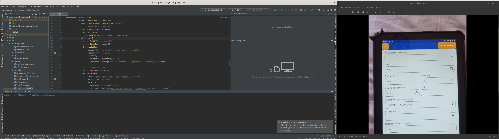
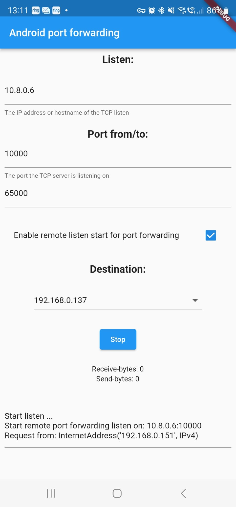

# Update & Debugging

<figure><figcaption></figcaption></figure>

## Problem

The table and the development environment are not in one place. The tablet can only be reached via a VPN or via remote maintenance (AnyDesk). To install the new version, you currently have to use Android Studio (with Flutter). The pairing of tablet and Android studio is lost due to updates.

## Solution

The tablet receives VPN and can be reached via this with an IP. Unfortunately, this IP cannot be selected in the Developer ⇾ Debug settings.

The second app is transferred, and port forwarding is set up in this app.

Now the tablet and Android Studio can be reconnected and paired.


## Steps

1. Install, set up and start [OpenVPN](https://play.google.com/store/apps/details?id=de.blinkt.openvpn\&hl=de\&gl=US). A private IP with <mark style="background-color:blue;">10.8.\*</mark> can be seen.

<figure><figcaption></figcaption></figure>

2. Connect to [AnyDesk](https://play.google.com/store/apps/details?id=com.anydesk.anydeskandroid\&hl=de\&gl=US) and transfer the second [app APF](https://github.com/stefanwerfling/apf). The remote person on the tablet installs this and starts it as follows:
   1. **Listen**: Specify the OpenVPN IP on lists, e.g. <mark style="background-color:blue;">10.8.0.6</mark>
   2. **Port from/to:** Leave port from to <mark style="background-color:blue;">10000</mark>, the second port is not of interest.
   3. "Enable remote listen start for port forwarding" Activate.
   4. **Destination**: Select the IP that the tablet has on the Wi-Fi. Usually start with a <mark style="background-color:blue;">192.168.\*</mark>
   5. Press the start button.

<figure><figcaption></figcaption></figure>

3. The developer on the other hand can check the list via browser: [http://10.8.0.6:10000/?action=info](http://10.8.0.6:10000/?action=info)
4. If everything works, the person on the tablet goes to Android "Settings" ⇾ "Developer options" ⇾ "Debugging via Wi-Fi".

<figure><figcaption></figcaption></figure>

5. &#x20;Activate
   1. "Pair the device using a pairing cord"
   2. You can now see the IP and port below. Example: <mark style="background-color:blue;">192.168.11.120</mark>:<mark style="background-color:orange;">40719</mark>
   3. The port is now activated by the developer on the other side with the URL: [http://10.8.0.6:10000/?action=open\_port\&port=<mark style="background-color:orange;">40719</mark>](http://10.8.0.6:10000/?action=open\_port\&port=40719)
   4. Now start the pair in the console in Android studio:

```sh
cd /home/~/Android/Sdk/platform-tools
```

```bash
./adb pair 10.8.0.6:40719
```

You will now be asked for the Wi-Fi pairing code.

```bash
./adb connect 10.8.0.6:40719
```

Done, the APP can now be delivered with Android studio.
